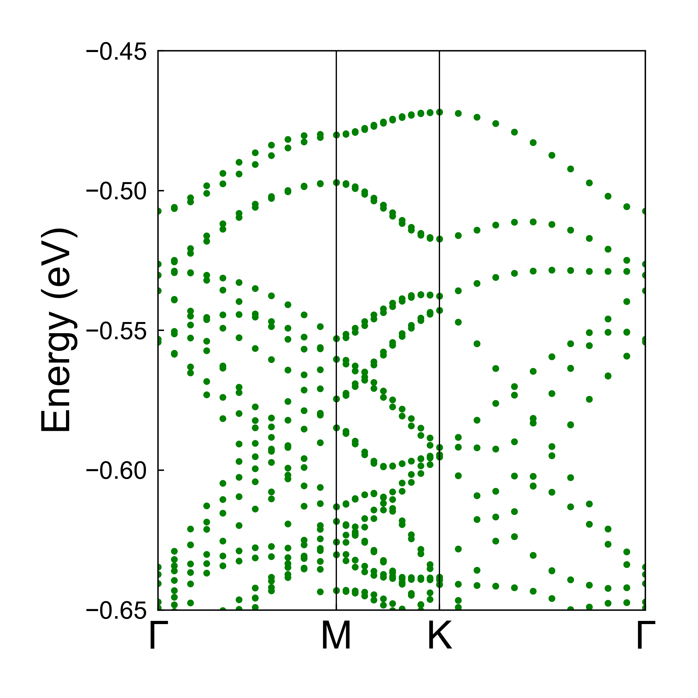
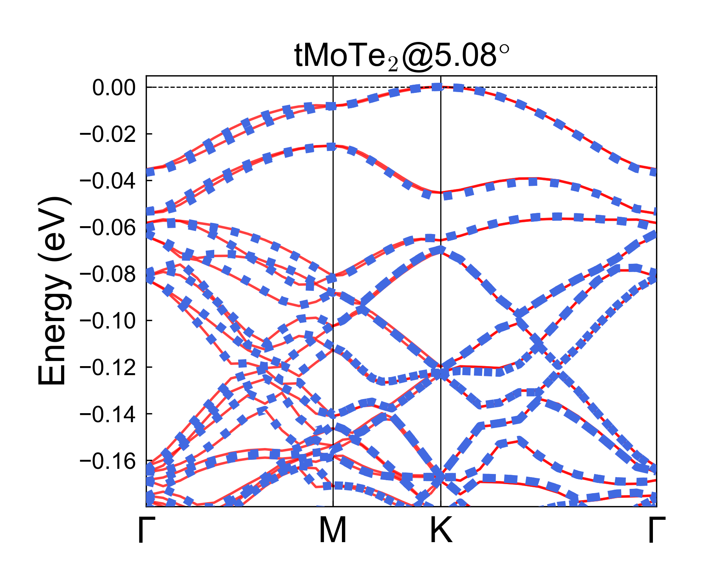
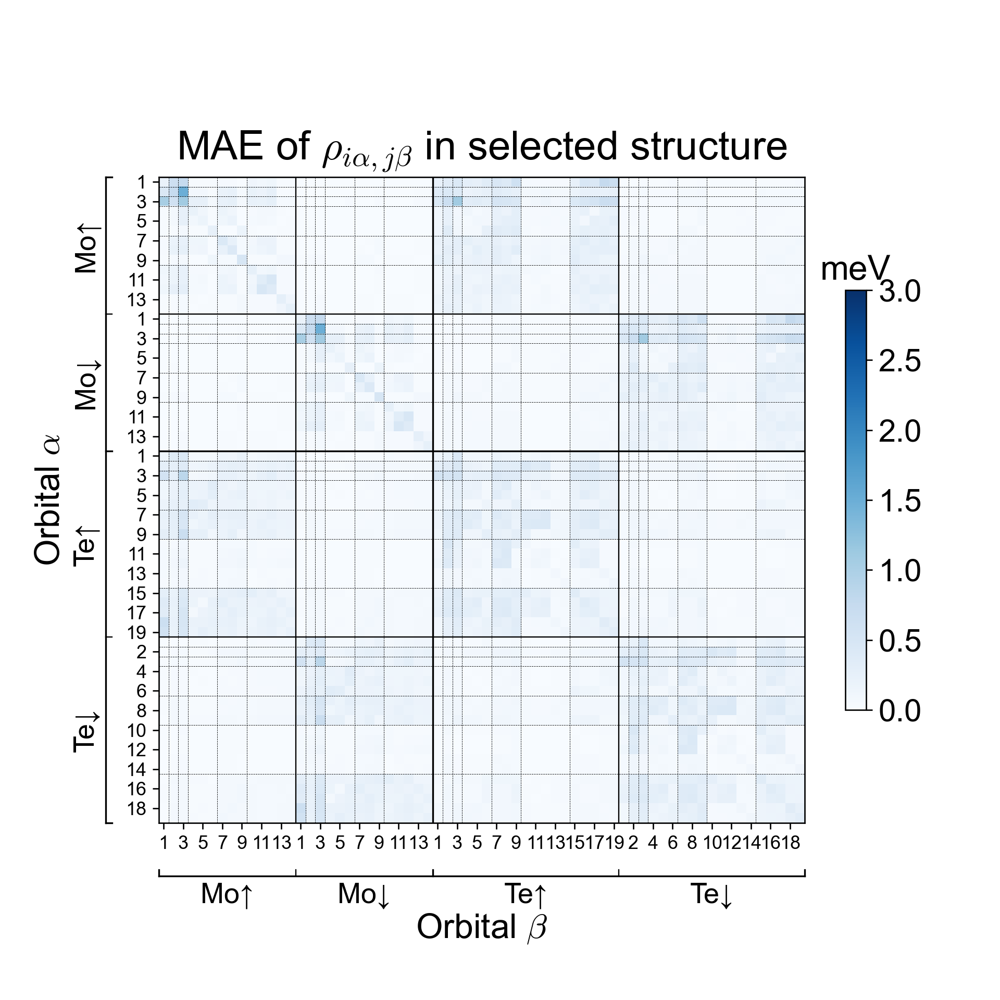

This is the github repo for using transfer learning skill to tackle the $tMoTe_2$ electronic Hamiltonians. Our method achieves an impressive accuracy and provides reliable electronic band and topological properties.

The corresponding paper is ***Transfer learning electronic structure: millielectron volt accuracy for sub-million-atom moiré semiconductor*** by T.Bao, N.Mao et al. For now, you can find this paper at https://arxiv.org/abs/2501.12452.

- Overview
- System requirements
- Installation guide
- Demo

- Instructions for use


# Overview

The systematic workflow of our transfer learning method is shown as following:


The detailed steps involves:

- Prepare the general dataset including non-twisted structures:
  - Use supercell of bilayer $MoTe_2$ and do interlayer shifting and pertubation to generate various structures
  - Conduct DFT calculation and extract the Hamiltonians for supervised learning;
- Prepare the twisted dataset (computational costly), similarly:
  - Start from the relaxed $tMoTe_2$, do pertubation to generate structures for the twisted dataset
  - Conduct DFT calculation and extract Hamiltonians
- Train Neural Network (NN) models 
  - First let the NN learn from the relative cheap non-twisted dataset 
  - Do transfer learning on costly twisted dataset, hyperparamenters are also fine-tuned
  - Mentionlly, we use 8 **DeepH-E3** models (see https://github.com/Xiaoxun-Gong/DeepH-E3) combined to get more accurate results

After NN inference on the target structures:

- (optional) Get electronic band and Chern numbers
- (optional) Apply to ultra large systems：
  - small-angle (down to $0.88^\circ$) twisted structures 
  - Nanoribbon systems

Steps mentioned above are selected from systematic tests and are **the best path known for now**. The well-trained models mentioned in the paper are available and we believe them to be the state-of-the-art models tackling $tMoTe_2$ electronic Hamiltonians.


# System requirements

We recommend to run all the code on **x86-CPU** computor/computational node with **Linux** OS. For practical use, we recommand to use a GPU with large GPU memory (e.g. Nvidia H100 GPU with 80GB VRAM), Nvidia **CUDA** is required when using GPU. 

Here we show an example computational node which is suitable for run out code on large systems:

- OS: Linux, Red Hat 8.5.0
- CPU:  2 * Intel Platinum 8463Y+ (64 cores)
- GPU: NVIDIA H100
- RAM: 1024GB

For application on normal size systems, less powerful configuration is also enough.

# Installation guide

A Python environment is required. To successfully run the code, please refer to the **full package list** at ` requirements.txt`，we list the **main packages** as following,

```
python=3.11
h5py=3.10.0
e3nn=0.4.4
pytorch=2.2.1
pytorch-cuda=12.1
pytorch-scatter=2.1.2
torch-geometric=2.5.2
```

For convenience, you can install all the packages using:

```
conda create -n transfer
conda install --yes --file requirements.txt
```

Since pytorch may support different versions of CUDA and GPU drivers, you can go to [Pytorch official website](https://pytorch.org/get-started/locally/)  to see the compatibility.

When inference the Hamiltonians using provided well-trained models here, a overlap matrix is required to compute in advance and the tutorial can be found at [mzjb/overlap-only-OpenMX](https://github.com/mzjb/overlap-only-OpenMX).

Additionally, to diagonalize NN inferenced Hamiltonians, you can use code at `Code/tsflearn-deephe3/inference_tools/sparse_calc_pardis.jl`, then you also need **Julia** with packages `DelimitedFiles, LinearAlgebra, JSON, HDF5, ArgParse, SparseArrays, Pardiso, Arpack, LinearMaps, JLD`.


# Demo

As a demonstration, I show the dataset generation, NN training, NN inference and postprocess here.

Notably, the application in our paper requires significant computational power, so the demonstration is merely a simplified version.

> [!NOTE]
>
> First 2 steps are computationally costy.

- (optional) Dataset preparation

  - For non-twisted dataset, go `Demo/1.dataset_generation/nontwist`:

    The unitcell 'POSCAR'  is provided, run

    ```
    cd Demo/1.dataset_generation/nontwist
    python gen_dataset1.py
    ```

    and the generated dataset is in the `config` folder, each item should follow:

    ```
    .
    ├── POSCAR_crystal
    ├── openmx_in.dat
    └── shift.json
    ```

    where the `openmx_in.dat` is the required input file to do OpenMX calculation. You can then run OpenMX as follows, change the mpi configuration according to your environment. Remember to `cat openmx.out >> openmx.scfout` for convenience of extracting Hamiltonians.

    ```
    mpirun -np {Number of cores} {Path to your compiled OpenMX} openmx_in.dat  > openmx.std
    cat openmx.out >> openmx.scfout
    ```

    You can also see a distribution of interlayer space figure like :

    

  - For twisted dataset, go `Demo/1.dataset_generation/twist`

    Here we provide a **relaxed** $tMoTe_2$ at $13.17^\circ$ (n=3, m=2 if using the twist n,m representation), the structure is wrritten in POSCAR. Run

    ```
    cd Demo/1.dataset_generation/twist
    python gen_dataset2.py
    ```

    The generated twisted dataset is located in the `config` folder. The configuration differs from the non-twisted case: no supercell is applied, and the perturbation step is smaller.

    For practical training , use POSCAR at several twist angles and apply pertubations.

- (optional) Neural network training

  - go `Demo/2.NN_training`, after getting the nontwist and twist dataset, you can use your dataset or download the provided demo dataset and put them in `Demo/2.NN_training/datasets`

    provided nontwisted dataset: https://cloud.tsinghua.edu.cn/d/18747f41cfbb45acb592/
    provided twisted dataset:  https://cloud.tsinghua.edu.cn/d/86725fd644394235a93e/
    
    
    Then you train the model by:
    
    ```
    cd Demo/2.NN_training
    python ../../Code/tsflearn-deephe3/deephe3-train.py --train1.ini
    ```
    
    where `train1.ini` is the config file, you can modify `train1.ini` to decide whether to use CUDA device or CPU to improve the efficiency. The final result will be at `Demo/2.NN_training/train1_result`.
    
    after getting the model trained by nontwisted data, we use the twisted dataset to do the transfer learning. You should firstly modify the `train2.ini`, then run following command to get the model further trained by twisted dataset:
    
    ```
    checkpoint_dir = !!PATH to best_model.pkl in the previous training!!
    ```
    
    The final model is in `Demo/2.NN_training/train2_result`.
    
  - For genuine practice training, the configuration file can be accessed at `Trained_models/models/momo/momo_diag_tsf.ini`, along with other corresponding folders.
  
- NN inference

  - Use models in `trained_models` （or models trained by yourself), we here do NN inference.

  - The DFT result of the example $tMoTe_2$ at $5.08^\circ$  is provided at https://cloud.tsinghua.edu.cn/d/d17f3cadecd04ecb9fe1/, download and put it in `Demo/3.NN_inference` before further steps.

  - For inference the configuration file is at`Demo/3.NN_inference/infer.ini`, run 

    ```
    cd Demo/3.NN_inference
    mkdir 5.08_pred
    python ../../Code/tsflearn-deephe3/deephe3-eval.py infer.ini
    ```

    After running for approximately one hour, the predicted Hamiltonian can be obtained in the `5.08_pred`folder.

- postprocess

  - Energy bands: 

    - Starting from the extracted Hamiltonians from DFT or the predicted Hamiltonian, here we show how to get the energy band, we can get the energy band of corresponding structures through:

    - First collect the predicted hamiltonians and related info files (info files borrowed from DFT folder in this Demo):
  
      ```
      cd Demo/4.post_progress
      cp -r ../3.NN_inference/5.08_pred ./
      cp ../3.NN_inference/5.08/*.dat ./5.08_pred/
      cp ../3.NN_inference/5.08/info.json ./5.08_pred/
      ```

    - use script to get the jld file and run the diagonalization (computationally costly) :
  
      ```
      cp ./*py 5.08_pred/
      cp ./sparse_calc_diag.jl 5.08_pred/
      cd 5.08_pred
      python get_band_diag.py
      bash cmd_all.sh
      ```
  
    - Following the diagonalization process, you can execute the following code to visualize the band structure:
  
      ```
      python plot_band_scatter_each_k.py -u -0.45 -d -0.65
      ```
  
      The `-u -d` defines the upper and lower bound of the energy band window, you may modify them.
  
      Same process can be done to the DFT-extracted Hamiltonian, and all result files are already in `Demo/3.NN_inference/5.08`, the energy bands are like:
  
      
  
  - Energy band comparison:
  
    - A comparative analysis between bands from DFT and bands predicted by NN reveals that the Fermi level is positioned at the top of the conduct band. Consequently, the following command can be executed:
  
      ```
      # run in the Demo/4.post_progress/5.08_pred
      python ./realign_band_plot_returndata.py -n 5.08 -r 0.175 \
      -p1 ../../3.NN_inference/5.08 \
      -p2 ../../4.post_progress/5.08_pred \
      -o ../../4.post_progress/5.08_pred
      ```
  
    - You can visualize the band comparison (DFT band in red and predicted one in blue) as follows:
  
      
  
  - Hamiltonian error:
  
    - It is possible to analyze the inference results since both the DFT and predicted results are stored in the graph file `HGraph-xx-.pkl`. To do this, run the following command:
  
      ```
      # run in the folder including test_result.h5, src/train.ini, src/dataset_info.json, src/target_blocks.json
      echo -e '4\nmae\n'$i'\n\nn\n0' | python Code/tsflearn-deephe3/deephe3-analyze.py
      mv analyze_result/MAE* analyze_result/$i
      ```
  
      The path to `deephe3-analyze.py` may change according where to run this code.
  
    - Go to the `analyze_result` folder and run
  
      ```
      python ../../error_heatmap.py error_info_combined.json
      ```
  
      You will get the error visualization on Hamiltonian, here is the result:
  
      

# Instruction of Use

Please refer to the Demo section. If you are specifically interested in $tMoTe_2$, we strongly recommend using our well-trained models located in the trained_models folder. This methodology should also be applicable to other twisted materials.


