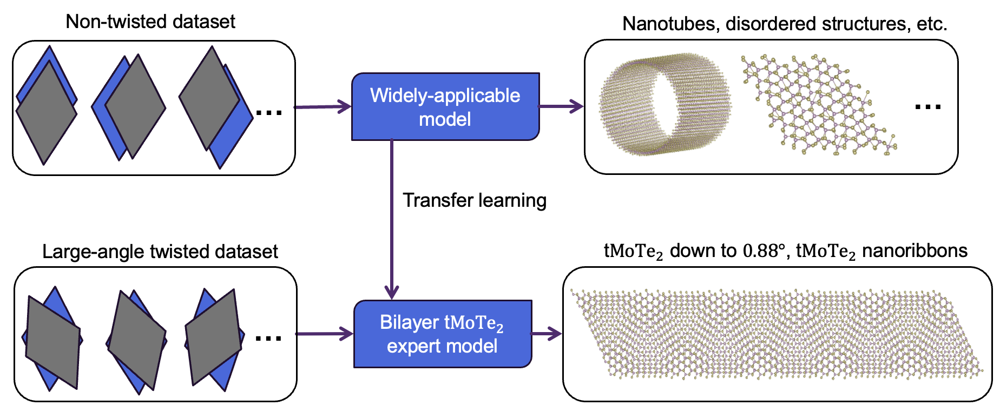
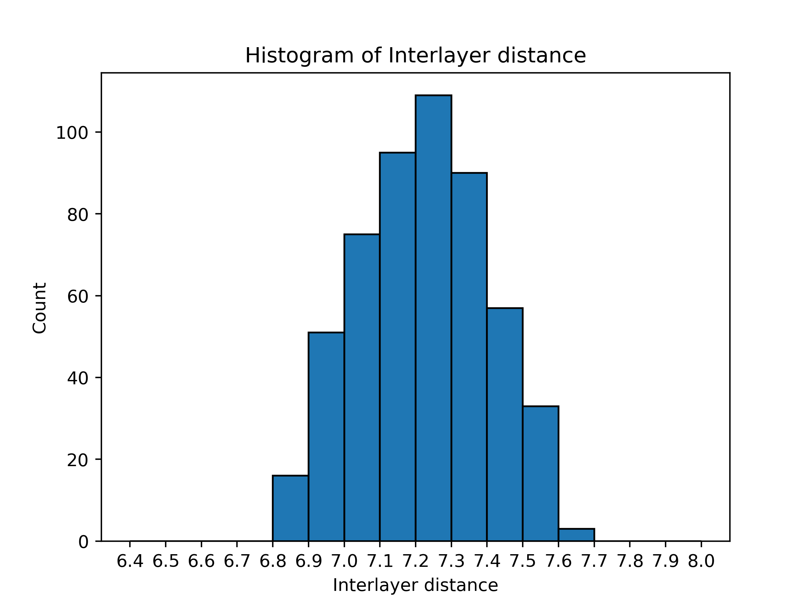

This is the github repo for using transfer learning skill to tackle the $tMoTe_2$ electronic Hamiltonians. Our method achieves an impressive accuracy and provides reliable electronic band and topological properties.

The corresponding paper is ***Transfer learning electronic structure: millielectron volt accuracy for sub-million-atom moiré semiconductor*** by T.Bao et al. For now, you can find this paper at https://arxiv.org/abs/2501.12452.

- Overview
- System requirements
- Installation guide
- Demo

- Instructions for use


# Overview

The systematic work flow of transfer learning is shown as following:



The detailed steps involves:

- Prepare the general dataset including non-twisted structures:
  - Use supercell of bilayer $MoTe_2$ and do interlayer shifting and pertubation to generate various structures
  - Do DFT calculation and extract the Hamiltonians for supervised learning;
- Prepare the twisted dataset (computational costly), similarly:
  - Start from the relaxed $tMoTe_2$, do pertubation to generate structures for the twisted dataset
  - Do DFT and extract Hamiltonians
- Train NN models 
  - First learn from the relative cheap non-twisted dataset 
  - Do transfer learning on costly twisted dataset, hyperparamenters are also fine-tuned
  - Mentionlly, we use 8 **DeepH-E3** models (see https://github.com/Xiaoxun-Gong/DeepH-E3) combined to get more accurate results

After inference the model on the target structures:

- (optional) Get electronic band and Chern numbers
- (optional) Apply to ultra large systems：
  - small-angle (down to $0.88^\circ$) twisted structures 
  - Nanoribbon systems

Steps mentioned above are selected from systematic tests and are **the best path known for now**. The well-trained models metioned in the paper will be available and we believe them to be the state-of-the-art models tackling $tMoTe_2$ electronic Hamiltonians.


# System requirements

We recommend to run all the code on **x86-CPU** computor/computational node with **Linux** OS. For practical use, we recommand to use a GPU with large GPU memory (e.g. Nvidia H100 GPU with 80GB VRAM), Nvidia **CUDA** is required when using GPU. 

Here we show an example computational node which is suitable for run out code on large systems:

- OS: Linux, Red Hat 8.5.0
- CPU:  2 * Intel Platinum 8463Y+ (64 cores)
- GPU: NVIDIA H100
- RAM: 1024GB

For application on normal size systems, less powerful configuration is also enough.

# Installation guide

A Python environment is required. To successfully run the code, please refer to the **full package list** at ` requirements.txt`，we list the **main packages** as following,

```
python=3.11
h5py=3.10.0
e3nn=0.4.4
pytorch=2.2.1
pytorch-cuda=12.1
pytorch-scatter=2.1.2
torch-geometric=2.5.2
```

For convenience, you can install all the packages using:

```
conda create -n transfer
conda install --yes --file requirements.txt
```

Since pytorch may support different versions of CUDA and GPU drivers, you can go to [Pytorch official website](https://pytorch.org/get-started/locally/)  to see the compatibility.

When inference the Hamiltonians using provided well-trained models here, a overlap matrix is required to compute in advance and the tutorial can be found at [mzjb/overlap-only-OpenMX](https://github.com/mzjb/overlap-only-OpenMX).

Additionally, to diagonalize NN inferenced Hamiltonians, you can use code at `Code/tsflearn-deephe3/inference_tools/sparse_calc_pardis.jl`, then you also need **Julia** with packages `DelimitedFiles, LinearAlgebra, JSON, HDF5, ArgParse, SparseArrays, Pardiso, Arpack, LinearMaps, JLD`.


# Demo

As a demonstration, I show the dataset generation, NN training, NN inference and postprocess here.

Mentionly, application in our paper requires relative heay computing power, so the demo is just a simple version.

> [!NOTE]
>
> First 2 steps are computationally costy and **you can directly use our trained models** and go to NN inference part.

- (optional) Dataset preparation

  - For non-twisted dataset, go `Demo/1.dataset_generation/nontwist`:

    The unitcel 'POSCAR'  is provided, run

    ```
    cd Demo/1.dataset_generation/nontwist
    python gen_dataset1.py
    ```

    and the generated dataset is in the `config` folder, each item should follow:

    ```
    .
    ├── POSCAR_crystal
    ├── openmx_in.dat
    └── shift.json
    ```

    where the `openmx_in.dat` is the required input file to do OpenMX calculation. You can then run OpenMX as follows, change the mpi configuration according to your environment. Remember to `cat openmx.out >> openmx.scfout` for convenience of extracting Hamiltonians.

    ```
    mpirun -np {Number of cores} {Path to your compiled OpenMX} openmx_in.dat  > openmx.std
    cat openmx.out >> openmx.scfout
    ```

    You can also see a distribution of interlayer space figure like :

    

  - For twisted dataset, go `Demo/1.dataset_generation/twist`

    Here we provide a **relaxed** $tMoTe_2$ at $13.17^\circ$ (n=3, m=2 if using the twist n,m representation), the structure is wrritten in POSCAR. Run

    ```
    cd Demo/1.dataset_generation/twist
    python gen_dataset2.py
    ```

    The generated twisted dataset is in the `config` folder. The configuration are different from the non-twist case: no supercell applied, smaller step of pertubation.

    For practical training , use POSCAR at several twist angles and apply pertubations.

- (optional) Neural network training

  - go `Demo/2.NN_training`, after get the nontwist and twist dataset, you can put your dataset or download the provided demo dataset and put them in `Demo/2.NN_training/datasets`

    ```
    provided nontwisted dataset: https://cloud.tsinghua.edu.cn/d/18747f41cfbb45acb592/
    provided twisted dataset: 		https://cloud.tsinghua.edu.cn/d/86725fd644394235a93e/
    ```

    Then you can use the train the model by:

    ```
    cd Demo/2.NN_training
    python ../../Code/tsflearn-deephe3/deephe3-train.py --train1.ini
    ```

    where `train1.ini` is the config file, you can modify `train1.ini` to decide use CUDA device or CPU to improve the efficiency. The final result will be at `Demo/2.NN_training/train1_result`.

    after getting the model trained by nontwisted data, we use the twisted dataset to do the transfer learning. You should first modify the `train2.ini`

    then run following command to get the model further trained by twisted dataset:

    ```
    checkpoint_dir = !!PATH to best_model.pkl in the previous training!!
    ```

    The final model is in `Demo/2.NN_training/train2_result`.

  - For real practice training, the configuration file can be see at `Trained_models/models/momo/momo_diag_tsf.ini` and other corrsponding folders.

- NN inference

  - Use models in `trained_models` （or models trained by yourself), we do NN inference.
  - The overlap
  - and the configuration file is at`` 

- postprocess

# Instruction of Use

Refer to Demo part. If you are interested in $tMoTe_2$ specifically, we strongly sugguest you to use our well-trained models at `trained_models` folder. And for other twisted materials, this methodology should also work well.


